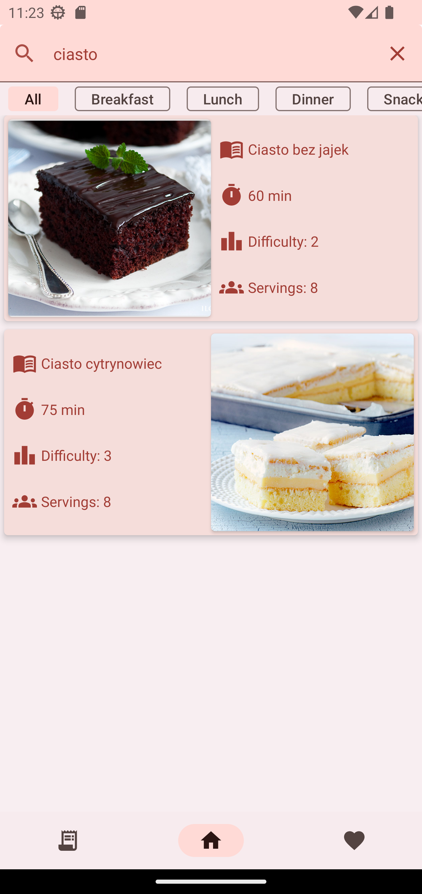
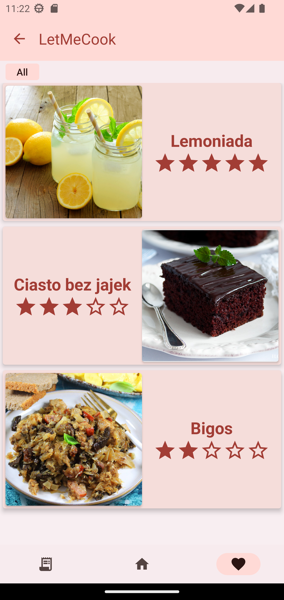

# Let Me Cook

Example mobile app for browsing recipes and cooking instructions.

## Authors:

- [Maciej Bazela (261743)](https://github.com/Flowyh)
- [Joanna Kulig (261738)](https://github.com/ajzia)
- [Marek Traczyński (261748)](https://github.com/Enigma717)
- [Józef Melańczuk (261703)](https://github.com/RychuKropkaExe)
- [Piotr Piotrowski (261723)](https://github.com/S2n0a0k0e)

## Dependencies

- kotlin 1.8.10
- Jetpack Compose 1.4.3
- Material3 1.1.0 (and material2 1.4.3 because of PullRefresh )
- Compose Destinations 1.9.42-beta
- Dagger-Hilt 2.46.1
- ViewModel, LifeData, Lifecycle 2.6.1
- Firestore SDK 24.6.0
- Room 2.5.1
- Glide 4.15.1

## Project overview

Our project follows MVVM architecture. We use Jetpack Compose for UI, Firestore and Room for 
external/local data storage, Hilt for dependency injection and ViewModels for sharing data between
domain and UI layers.

Each layer is split into different subpackages:
- controllers - contains classes responsible for fetching from data sources and Hilt modules
- models - contains application entity models
- ui - contains UI components (composables, screens, theming, navigation)
- viewmodels - contains ViewModels for several parts of the application

## Project structure

```
└───com
    └───flowyh
        └───letmecook
            ├───controllers
            │   ├───di
            │   ├───interfaces
            │   └───repositories
            ├───models
            ├───ui
            │   ├───components
            │   ├───navigation
            │   ├───screens
            │   └───theme
            └───viewmodels 
```

## Quick look

### Light Mode

- Recipe List view


- Detailed recipe view


- Searching by name



- Searching using filters


- Rated recipes view



- Shopping list view


### Dark Mode


## Features

- [x] Browsing recipe list (image + quick info)
- [x] Recipe list chips section filters (filter by course type)
- [x] Recipe details screen
  - [x] Rating recipe
  - [x] Adding recipe ingredients as a shopping list
- [x] Top Bar
  - [x] Search bar
  - [x] Jump to random recipe details screen
  - [x] Jump to recipe of the day details screen
- [x] Nav bar  
  - [x] Home screen
  - [x] Shopping list screen
  - [x] Rated recipes screen (favorites)
- [x] Shopping list screen
  - [x] Adding ingredients to shopping list
  - [x] Removing ingredients from shopping list
  - [x] Removing shopping list
  - [x] Link to recipe details screen
- [x] Rated recipes screen
  - [x] Link to recipe details screen

- [x] Cool theme (light and dark)
- [x] Cool animations
- [x] Cool transitions between navigated screens

